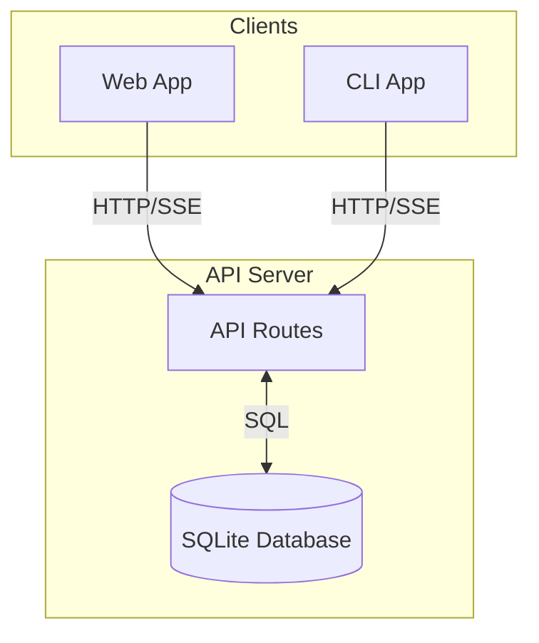

# Chat Session Database Plan

## Overview
Add a SQLite database to the API for persistent storage of chat sessions and messages. This enables users to save conversations and resume them later from either the web or CLI applications.

## Architecture



## Database Schema

### Tables

#### sessions
| Column | Type | Description |
|--------|------|-------------|
| id | TEXT PRIMARY KEY | UUID for the session |
| title | TEXT | Human-readable session title (auto-generated from first query) |
| model | TEXT | Model used for this session |
| provider | TEXT | Provider used for this session |
| created_at | DATETIME | When session was created |
| updated_at | DATETIME | When session was last updated |

#### messages
| Column | Type | Description |
|--------|------|-------------|
| id | TEXT PRIMARY KEY | UUID for the message |
| session_id | TEXT FK | Reference to sessions.id |
| role | TEXT | 'user' or 'assistant' |
| content | TEXT | Message content |
| created_at | DATETIME | When message was created |

#### events (optional - for full replay)
| Column | Type | Description |
|--------|------|-------------|
| id | TEXT PRIMARY KEY | UUID for the event |
| session_id | TEXT FK | Reference to sessions.id |
| message_id | TEXT FK | Reference to messages.id (nullable) |
| type | TEXT | Event type (thinking, tool_start, tool_end, etc.) |
| data | JSON | Event payload |
| created_at | DATETIME | When event occurred |

## API Endpoints

### Session Management

| Method | Endpoint | Description |
|--------|----------|-------------|
| GET | /api/sessions | List all sessions (sorted by updated_at desc) |
| POST | /api/sessions | Create new session |
| GET | /api/sessions/:id | Get session with all messages |
| PATCH | /api/sessions/:id | Update session (title, etc.) |
| DELETE | /api/sessions/:id | Delete session and all messages |

### Chat

| Method | Endpoint | Description |
|--------|----------|-------------|
| POST | /api/chat | Stream chat (modified to accept sessionId, saves messages) |

## Implementation Details

### 1. Database Module (`apps/api/src/db/`)

```typescript
// apps/api/src/db/index.ts
import { Database } from 'bun:sqlite';

export const db = new Database('.dexter/dexter.db');

export function initDatabase() {
  // Create tables if not exist
}
```

### 2. Session Routes (`apps/api/src/routes/sessions.ts`)

New Hono router for session CRUD operations.

### 3. Modified Chat Route (`apps/api/src/routes/chat.ts`)

Update to:
- Accept `sessionId` parameter
- Save user message before streaming
- Save assistant message after streaming completes
- Create new session if `sessionId` not provided

### 4. Web App Updates

#### API Client (`apps/web/src/api/client.ts`)
Add functions:
- `fetchSessions()`
- `createSession(title?)`
- `fetchSession(id)`
- `deleteSession(id)`

#### useAgent Hook (`apps/web/src/hooks/useAgent.ts`)
- Accept optional `sessionId` parameter
- Load existing messages when session is selected
- Save messages as they're generated

#### Sidebar (`apps/web/src/components/Sidebar/Sidebar.tsx`)
- Replace demo sessions with real data
- Add click handler to load session
- Add delete functionality

#### App State (`apps/web/src/App.tsx`)
- Track current session ID
- Pass to ChatInterface and Sidebar

### 5. CLI App Updates (Optional)

Add flag to use API instead of local storage:
```bash
dexter --use-api  # Use API persistence
dexter            # Use local file storage (current behavior)
```

## Data Flow

### Creating New Session
1. User sends first message
2. API creates new session record
3. API saves user message
4. API streams agent response
5. API saves assistant message
6. API returns session ID to client

### Resuming Session
1. Client fetches session list
2. User clicks on session
3. Client loads session with messages
4. User sends new message
5. API saves to existing session

### Schema Migration Strategy

Since this is a local SQLite database, use simple version tracking:

```sql
CREATE TABLE schema_version (
  version INTEGER PRIMARY KEY
);

-- Check version on startup, run migrations as needed
```

## File Locations

```
apps/api/src/
  db/
    index.ts          # Database connection + init
    schema.ts         # Schema definitions
    migrations.ts     # Migration runner
  routes/
    sessions.ts       # Session CRUD endpoints
    chat.ts           # Modified chat endpoint

apps/web/src/
  api/
    client.ts         # Add session API functions
  hooks/
    useSessions.ts    # New hook for session management
```

## Dependencies

- `bun:sqlite` - Built into Bun, no additional dependency needed

## Testing Strategy

1. Test database initialization
2. Test session CRUD operations
3. Test chat with persistence
4. Test session resumption
5. Test concurrent access (if applicable)

## Future Enhancements

- Search sessions by content
- Export session to markdown/PDF
- Session tags/categories
- Session sharing (export/import)
