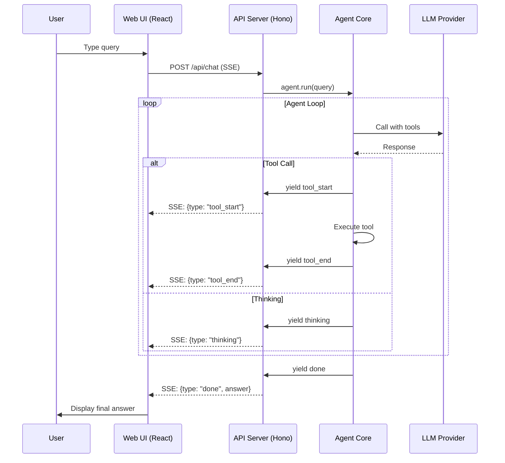

# Dexter Frontend UI Implementation Plan

## Overview
Hybrid approach: Keep the existing CLI (Ink + React) and add a web UI (React + Vite) with a shared backend API.

## Architecture

```
┌─────────────────┐     ┌─────────────────┐     ┌─────────────────┐
│   CLI (Ink)     │     │  Web Frontend   │     │  API Server     │
│  src/cli/       │     │  apps/web/      │     │  apps/api/      │
│                 │     │                 │     │                 │
│ ┌─────────────┐ │     │ ┌─────────────┐ │     │ ┌─────────────┐ │
│ │ CLI UI      │ │     │ │ React UI    │ │────▶│ │ Hono API    │ │
│ │ Components  │ │     │ │ Components  │ │WS   │ │ Server-Sent │ │
│ └─────────────┘ │     │ └─────────────┘ │     │ │ Events      │ │
│       │         │     │       │         │     │ └─────────────┘ │
│       │         │     │       │         │     │       │         │
│       ▼         │     │       ▼         │     │       ▼         │
│ ┌─────────────┐ │     │ ┌─────────────┐ │     │ ┌─────────────┐ │
│ │ useAgent    │ │     │ │ useAgent    │ │     │ │ Agent       │ │
│ │ Runner      │ │     │ │ Runner      │ │     │ │ Runner      │ │
│ │ (local)     │ │     │ │ (API)       │ │     │ │ (shared)    │ │
│ └─────────────┘ │     │ └─────────────┘ │     │ └─────────────┘ │
│       │         │     └─────────────────┘     │       │         │
│       ▼         │                             │       ▼         │
│ ┌─────────────┐ │                             │ ┌─────────────┐ │
│ │ Shared Core │ │◄────────────────────────────┤ │ Shared Core │ │
│ │ packages/   │ │                             │ │ packages/   │ │
│ └─────────────┘ │                             │ └─────────────┘ │
└─────────────────┘                             └─────────────────┘
```

## Project Structure (Monorepo)

```
dexter/
├── apps/
│   ├── api/                    # Hono API server (NEW)
│   │   ├── src/
│   │   │   ├── index.ts        # Server entry
│   │   │   ├── routes/
│   │   │   │   ├── chat.ts     # Chat/streaming endpoints
│   │   │   │   ├── models.ts   # Model selection endpoints
│   │   │   │   └── health.ts   # Health check
│   │   │   └── middleware/
│   │   ├── package.json
│   │   └── tsconfig.json
│   │
│   └── web/                    # React + Vite frontend (NEW)
│       ├── src/
│       │   ├── main.tsx        # Vite entry
│       │   ├── App.tsx         # Root component
│       │   ├── components/
│       │   │   ├── Chat/       # Chat interface
│       │   │   ├── Sidebar/    # History sidebar
│       │   │   └── EventLog/   # Tool execution view
│       │   ├── hooks/
│       │   │   └── useAgent.ts # API-based agent hook
│       │   └── api/
│       │       └── client.ts   # API client
│       ├── package.json
│       ├── vite.config.ts
│       └── index.html
│
├── packages/
│   └── core/                   # Shared agent logic (EXTRACTED)
│       ├── src/
│       │   ├── agent/          # From src/agent/
│       │   ├── tools/          # From src/tools/
│       │   ├── model/          # From src/model/
│       │   ├── skills/         # From src/skills/
│       │   ├── utils/          # Shared utilities
│       │   └── types/          # Shared types
│       ├── package.json
│       └── tsconfig.json
│
├── apps/cli/                   # Existing CLI (MOVED)
│   ├── src/
│   │   ├── cli.tsx
│   │   ├── index.tsx
│   │   ├── components/         # Ink components
│   │   └── hooks/              # CLI-specific hooks
│   ├── package.json
│   └── tsconfig.json
│
├── package.json                # Root workspace config
└── turbo.json                  # Turborepo config
```

## Implementation Phases

### Phase 1: Extract Shared Core
**Goal**: Move agent logic into a shared package ✅ COMPLETE

- [x] Create `packages/core/` package
- [x] Move `src/agent/` → `packages/core/src/agent/`
- [x] Move `src/tools/` → `packages/core/src/tools/`
- [x] Move `src/model/` → `packages/core/src/model/`
- [x] Move `src/skills/` → `packages/core/src/skills/`
- [x] Extract shared utilities
- [x] Update imports to use package references
- [x] Verify CLI still works

### Phase 2: Create API Server ✅ COMPLETE (2026-02-07)
**Goal**: HTTP API with Server-Sent Events for streaming

- [x] Create `apps/api/` with Hono
- [x] Implement `/api/chat` endpoint with SSE streaming
- [x] Implement `/api/models` endpoint for model selection
- [x] Implement `/api/health` health check
- [x] Create API-based agent runner (wraps core agent)
- [x] Add CORS support for local dev
- [x] Test API with curl/browser

### Phase 3: Create Web Frontend ✅ COMPLETE (2026-02-07)
**Goal**: React + Vite UI matching CLI functionality

- [x] Create `apps/web/` with Vite + React + TypeScript
- [x] Set up shadcn/ui or similar component library
- [x] Create API client for backend communication
- [x] Build chat interface with message history
- [x] Build real-time event viewer (tool calls, thinking)
- [x] Add model selector UI
- [x] Add sidebar for conversation history
- [x] Implement streaming message display
- [x] Add dark/light mode support

### Phase 4: Polish & Integration
**Goal**: Production-ready setup

- [ ] Add authentication (optional API key management)
- [ ] Add error handling and retry logic
- [ ] Add loading states and skeletons
- [ ] Mobile responsive design
- [ ] Docker support for easy deployment
- [ ] Environment-based configuration
- [ ] Build scripts for all apps

## Key Technical Decisions

### 1. Package Manager
**Bun Workspaces** (already using Bun)
- Root `package.json` with `"workspaces": ["apps/*", "packages/*"]`
- Turborepo for task orchestration

### 2. API Server - Hono
- Lightweight, fast, TypeScript-native
- Built-in SSE support
- Compatible with Bun runtime

### 3. Frontend Stack
- **Vite** - Fast dev server, optimal builds
- **React 19** - Latest features, concurrent features
- **Tailwind CSS** - Utility-first styling
- **shadcn/ui** - High-quality accessible components
- **TanStack Query** - Server state management

### 4. Shared Core Package
- Pure TypeScript (no React/Ink dependencies)
- ESM exports only
- Clear API surface for agent execution

## Data Flow



## API Endpoints

### POST /api/chat
Stream agent responses via Server-Sent Events.

**Request:**
```json
{
  "query": "Analyze Apple's revenue growth",
  "model": "gpt-5.2",
  "provider": "openai",
  "conversationId": "uuid"
}
```

**SSE Events:**
```
event: thinking
data: {"message": "Planning analysis steps..."}

event: tool_start
data: {"tool": "financial_search", "args": {"ticker": "AAPL"}}

event: tool_end
data: {"tool": "financial_search", "result": {...}}

event: done
data: {"answer": "Apple's revenue...", "tokenUsage": {...}}
```

### GET /api/models
List available models and providers.

### GET /api/health
Health check endpoint.

## Component Mapping (CLI → Web)

| CLI Component | Web Equivalent |
|--------------|----------------|
| `Input` | Chat input with submit |
| `HistoryItemView` | Message bubble with events |
| `AgentEventView` | Collapsible event log |
| `WorkingIndicator` | Typing/spinner indicator |
| `ModelSelector` | Dropdown/select component |
| `AnswerBox` | Markdown renderer |
| `DebugPanel` | Dev tools panel (optional) |

## File Structure Details

### packages/core/src/index.ts
```typescript
// Re-export everything needed by apps
export { Agent } from './agent/agent.js';
export { getTools } from './tools/registry.js';
export { callLlm } from './model/llm.js';
export type { AgentEvent, AgentConfig } from './agent/types.js';
```

### apps/api/src/routes/chat.ts
```typescript
import { Hono } from 'hono';
import { Agent } from '@dexter/core';

const chat = new Hono();

chat.post('/', async (c) => {
  const { query, model, provider } = await c.req.json();
  
  const stream = new ReadableStream({
    async start(controller) {
      const agent = Agent.create({ model, modelProvider: provider });
      
      for await (const event of agent.run(query)) {
        controller.enqueue(`event: ${event.type}\n`);
        controller.enqueue(`data: ${JSON.stringify(event)}\n\n`);
      }
      
      controller.close();
    }
  });
  
  return new Response(stream, {
    headers: {
      'Content-Type': 'text/event-stream',
      'Cache-Control': 'no-cache',
    }
  });
});
```

### apps/web/src/hooks/useAgent.ts
```typescript
export function useAgent() {
  const [events, setEvents] = useState<AgentEvent[]>([]);
  
  const sendMessage = useCallback(async (query: string) => {
    const response = await fetch('/api/chat', {
      method: 'POST',
      headers: { 'Content-Type': 'application/json' },
      body: JSON.stringify({ query, model: 'gpt-5.2', provider: 'openai' })
    });
    
    const reader = response.body?.getReader();
    // Parse SSE stream and update events state
  }, []);
  
  return { events, sendMessage };
}
```

## Progress

### Phase 1: Extract Shared Core ✅ COMPLETE (2026-02-07)
- Created `packages/core/` with all agent logic
- Moved CLI to `apps/cli/`
- Set up Bun workspaces with Turborepo
- Verified CLI still works

### Phase 2: Create API Server ✅ COMPLETE (2026-02-07)
- Created `apps/api/` with Hono and SSE streaming
- Implemented `/api/chat`, `/api/models`, and `/api/health`
- Added CORS support and shared model providers with core

### Phase 3: Create Web Frontend ✅ COMPLETE (2026-02-07)
- Created `apps/web/` with Vite + React + TypeScript
- Built chat interface with [`ChatInterface.tsx`](apps/web/src/components/Chat/ChatInterface.tsx), [`MessageBubble.tsx`](apps/web/src/components/Chat/MessageBubble.tsx)
- Added event viewer with [`EventLog.tsx`](apps/web/src/components/Chat/EventLog.tsx)
- Implemented model selector with [`ModelSelector.tsx`](apps/web/src/components/Chat/ModelSelector.tsx)
- Added sidebar with [`Sidebar.tsx`](apps/web/src/components/Sidebar/Sidebar.tsx)
- Created API client in [`client.ts`](apps/web/src/api/client.ts) and hook in [`useAgent.ts`](apps/web/src/hooks/useAgent.ts)

### Next Steps

1. ~~Phase 1~~ ✅ COMPLETE
2. ~~Phase 2~~ ✅ COMPLETE
3. ~~Phase 3~~ ✅ COMPLETE
4. **Phase 4**: Polish & Integration
